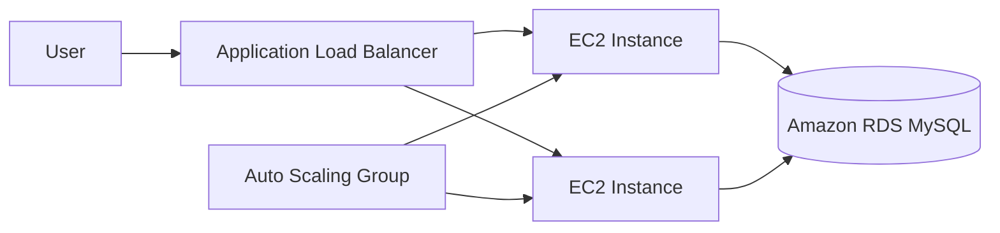

# Terraform Phonebook on AWS

A personal DevOps portfolio project by **Yazen Albu**.

This project deploys a Python Flask phonebook application on AWS using Terraform. The infrastructure uses an Application Load Balancer, an Auto Scaling Group of EC2 instances, and an Amazon RDS MySQL database.

> Training note: this project is based on an ONDIA Academy training exercise and has been adapted, reorganized, and customized as a personal Terraform project by Yazen Albu.

## Architecture



## Main AWS Components

- Terraform
- AWS Provider
- Default VPC discovery
- Application Load Balancer
- Target Group and HTTP Listener
- Launch Template
- Auto Scaling Group
- Amazon EC2
- Amazon RDS MySQL
- Security Groups
- User Data bootstrap
- Python Flask
- Gunicorn

## Project Goals

- Deploy the same application automatically with Infrastructure as Code.
- Keep the web tier scalable through an Auto Scaling Group.
- Keep the database separated from the application instances.
- Allow traffic to EC2 only through the load balancer.
- Keep database access restricted to the application security group.
- Avoid storing AWS credentials or database passwords in Git.

## Planned Structure

```text
terraform-phonebook-aws/
├── app.py
├── init_db.py
├── requirements.txt
├── database/
│   └── init.sql
├── templates/
│   ├── index.html
│   ├── add-update.html
│   └── delete.html
├── provider.tf
├── data.tf
├── variables.tf
├── security-groups.tf
├── rds.tf
├── alb.tf
├── autoscaling.tf
├── outputs.tf
├── userdata.sh.tftpl
├── terraform.tfvars.example
└── README.md
```

## Deployment

The normal Terraform workflow will be:

```bash
terraform init
terraform fmt
terraform validate
terraform plan
terraform apply
```

After testing:

```bash
terraform destroy
```

## Security

Real secrets must never be committed to this repository.

The database password is provided through a sensitive Terraform variable and a local `terraform.tfvars` file that is ignored by Git.

## Status

Repository structure and Terraform configuration are being prepared. AWS deployment validation is still pending.

## Author

**Yazen Albu**

- GitHub: https://github.com/yazenAlbu
- LinkedIn: https://www.linkedin.com/in/yazen-albu
